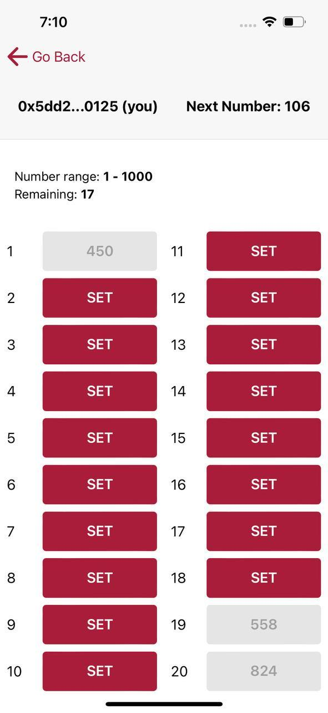
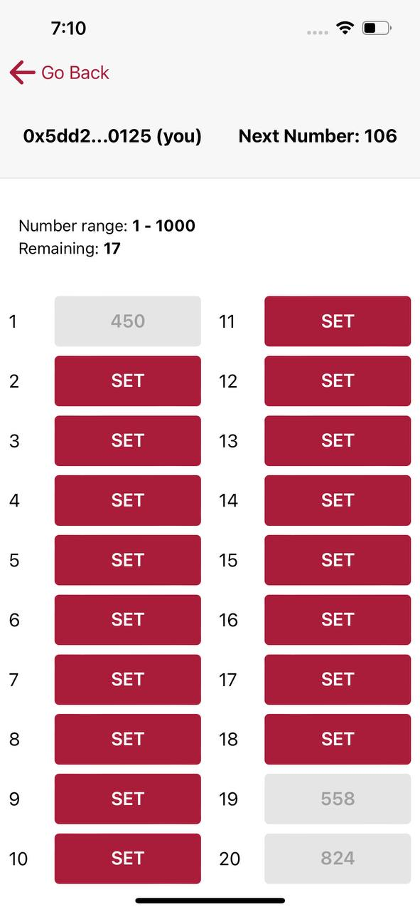
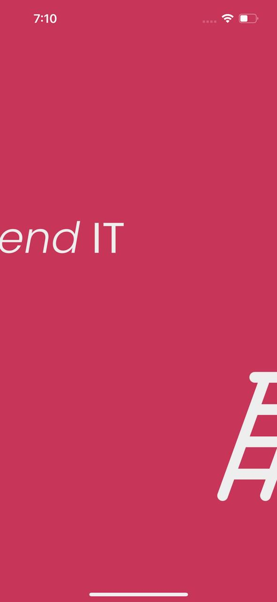
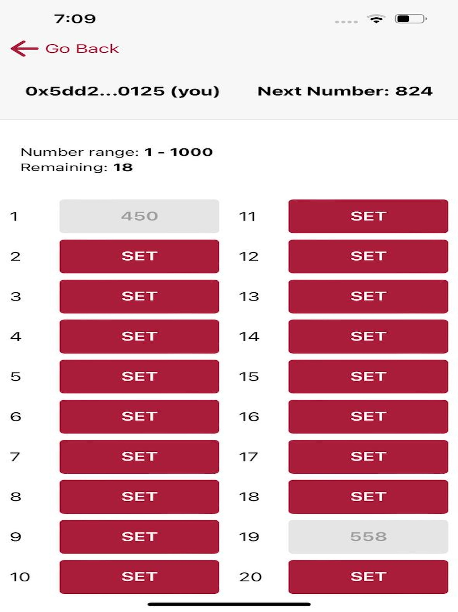

# AscendIt

AscendIt is an addictive puzzle game that tests your strategic thinking and quick decision-making skills. Random numbers appear, and you must place them in available slots in increasing order. But if a number doesn't fit, your game ends instantly!

Crafted with Dojo and StarkNet , this innovative app offers an immersive and challenging experience. Each game is unique, keeping you on your toes as you adapt your strategy to outsmart the randomness. With its sleek interface and endless replayability, "AscendIt" delivers hours of brain-teasing fun for puzzle enthusiasts and casual gamers alike.


| Home | Leaderboard | Game Rules |
|:---:|:---:|:---:|
|  |  |  |

| Game Screen | Active Game | Settings |
|:---:|:---:|:---:|
|  |  |  |


## Features

- Addictive and challenging puzzle gameplay
- Unique and randomly generated puzzles for endless replayability
- Uses gasless transactions so you don't need to pay anything when making a transaction
- Sleek and intuitive user interface
- Cross-platform compatibility (available on iOS and Android) - Currently in app store review mode
- App uses phone persistent storage, that means whenever you create a wallet, it will be available until you manually delete the wallet or uninstall the app.


## Help make us the game better by <a href="https://testflight.apple.com/join/0VjqcGHL" target="_blank">becoming a beta tester!</a>


# Technology

- Smart contracts are written in [Cairo](https://book.cairo-lang.org/title-page.html) and uses [Dojo Engine](https://www.dojoengine.org/)
- Contracts are deployed on [Katana](https://book.dojoengine.org/toolchain/katana)
- [Torii](https://book.dojoengine.org/toolchain/torii) as an event indexer and frontend uses torii graphql endpoint.
- ReactJS along with <a href="https://capacitorjs.com/docs/getting-started" target="_blank">Capacitor</a> is used to develop the mobile app. 

## Getting Started

### Prerequisites
- You must have [XCode](https://developer.apple.com/xcode/) install in your machine in order to run the app locally.
- You must have [NodeJS](https://nodejs.org/en) version 16 or above


Clone the repository
```
git clone https://github.com/satyambnsal/ascendit
```

Go to my-app folder
```
cd my-app
```

Install dependencies
```
npm install #or yarn #or bun install
```

Run app in development mode in browser
```
yarn run dev
```

Sync the changes to ios app
```
yarn run build-sync
```

Open the app in XCode
```
yarn run open
```

Now you should be able to click on `Build` button in ios to build it in a ios emulator or ios device connected to your machine.


Also I was streaming most of the time during the development 😅 so in case you want to see me struggling and you have nothing better to do, checkout the [Build an ios app for dojo game](https://www.youtube.com/watch?v=e0h9CcbloyE&t=4132s)

# Contact
If you face any issue, or have a feedback, please do reach out to me on any

Email: satyamsgsits1994@gmail.com

Telegram: https://t.me/satyambnsal

Discord: https://discordapp.com/users/satyambnsal


# References

Huge thanks to broody from Cartridge team to create a original web version for the game. I basically copied all smart contracts from his repo 😅